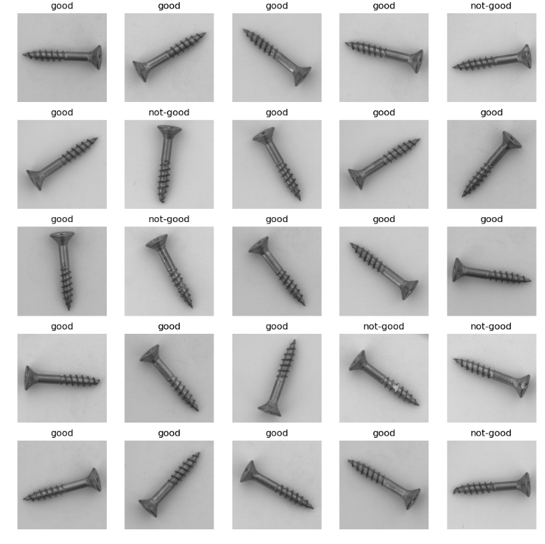

# Defected vs. Good Screws Classification

This repository contains code for training machine learning models to classify defected and good screws based on images of the screws. The models are trained on a dataset of labeled images and can be used to predict the class of a new image.

## Dataset

The dataset used to train the models can be found in this link [Data](https://drive.google.com/file/d/11ozVs6zByFjs9viD3VIIP6qKFgjZwv9E/view) .Please Download the data. It consists of two subdirectories, `good` and `not-good`, which contain images of defected and good screws, respectively. The data also consists of a testset

## Models

The code for training and evaluating the models can be found in the `models` directory. We have implemented and compared the performance of multiple machine learning models including:

- Convolutional Neural Network (CNN) (EfficientNet)


You can find the implementation of each model in a separate Python file. Each model has been trained on the same dataset, and the training and evaluation metrics can be found in the respective Python files.
## Matrics for Comparison
Considering the limited number of no-good images. Precision value of class `not-good` was considered as the main matric
## Model Comparison

We compared the performance of the three models on the dataset, and here are the results:

| Model                        | Precision of class Not-good |
|------------------------------|----------|
| EfficientNet B3| .82     |


### Model Predictions

Here are the example images with the predictions of the trained models:





## Usage

To train the model run `train.py` file. 

```python
python train.py 
```

To do inference on trained model download the weights go this this [link](https://www.kaggle.com/datasets/badgenius/screwed-weights)

```python
python test.py /home/user/data/test /home/user/models/weights

